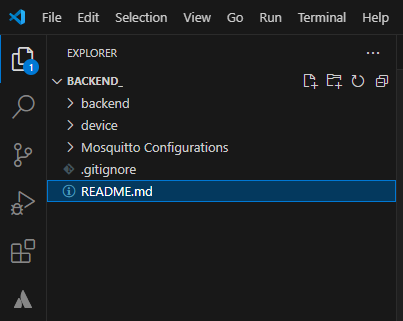
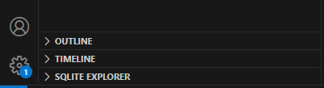
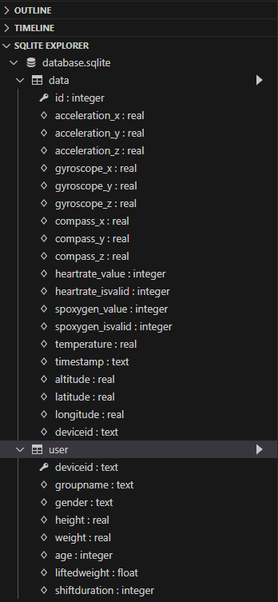

# IDG Academy Napoli -> Backend

## Tools installation
Install the following tools:

* install nodejs
* install vscode
* install some useful vscode plugins from vscode extensions:
    * SQLite: database viewer and querier
    * REST Client: easy way to test APIs with a .http file

## Clone the repository

* On your local machine, create the folder where you will store your local repository
* On the main page of the Bitbucket repository, click on *Clone* (top-right part of the page)
* Select the option *Clone in VS Code* and allow the site to open Visual Studio Code. A pop-up window should appear - check the box to give permission and then click on *Open*.
* Visual Studio Code should open and you need to allow the URI to be opened. Click *Open* in the pop-up window that shows up.
* Select *Clone new copy*, choose the folder you created in the first step and click *Select as repository destination*.


After a few seconds, you should see the repository cloned and opened in your Visual Studio Code. In the Explorer panel (top-left side), you should see the following structure:




## First set up
Before running the software, **only the first time**, you need to install all the required packages to ensure proper execution. Follow these steps:<br>

* In the project folder in VSCode, open a new terminal (cmd)
* Navigate to the `backend` folder by typing 
  ``` bash
  cd backend
  ```
* Type 
  ``` bash 
  npm init
  ```
* Type 
  ``` bash 
  npm install
  ```
* In a few seconds all packages present in `package_json` file will be automatically installed
* Repeat this procedure for the `device` folder. Open a new terminal (cmd) and type:
  ``` bash
  cd device
  npm init
  npm install
  ```


## Populate the database with some example content
The code you are provided with, includes  examples of queries that you can use to create the tables and populate them with sample data.

In the left panel of VSCode, you should see a tab for **SQLITE EXPLORER**, like this: 



If not, click on the folder *backend*, right-click on `database.sqlite` and select *Open Database*. Now you should see the **SQLITE EXPLORER** tab. 

Once you have verified that the SQLite extension is installed in VSCode, you can proceed with the population of the database. <br>

* Open `backend/TablePopulationQuery.sql`
* Right-click and select *Run query* (if a dropdown appears in the search bar, select the first option)

Check that the database was populated <br>

* Right-click on `database.sqlite` and select *Open Database*
* In the **SQLITE EXPLORER** you should see two tables (`user`and `data`)

  

* Click on the play icon to see the content of the table

## Start the server

* Open a VSCode terminal (cmd) in the `backend` folder
* To start the server, run
  ```bash
  node index.js
  ```
* To stop the server, press `Ctrl+c`

## Test APIs in an easy way via Rest Client

* Make sure **Rest Client** extension is installed on VSCode
* Start the server as described above
* Open `APISimpleTest.http` file
* Define your requests (GET/POST/PUT/DELETE...)
* Click *send request*

## Start a Mosquitto instance

* Download and install Eclipse Mosquitto x64 from web (requires admin level) -- should already be installed

    ⚠️ **Do not** open mosquitto.exe manually, see below

* Copy the path to the `mosquitto.conf` file, located in the project folder (should be `./Mosquitto Configurations/Windows/mosquitto.conf`)
* Open a cmd terminal in the folder thwere the **Mosquitto executable** (i.e. mosquitto.exe) is located (e.g. `C:\Programfiles\mosquitto`)
* To start the broker instance, run
  ```bash
  mosquitto -c <mosquitto.conf file path> -v
  ```
* To stop the broker, press `Ctrl+c`


## Start the Client instance

* Open a VSCode terminal (cmd) in the `device` folder
  
    💡 **HINT** Split the terminal view so you can run the client instance and the server in parallel, and check them simultaneously.

* To start the client, tun
  ```bash
  node client.js
  ```
* To stop the client, press ctrl+c


### Port is already in use error

This means an instance is already running --> to close it, admin privileges are needed
* Closing the process is the first option
* 2nd option is to go into the configuration file and change the listening port of the broker


